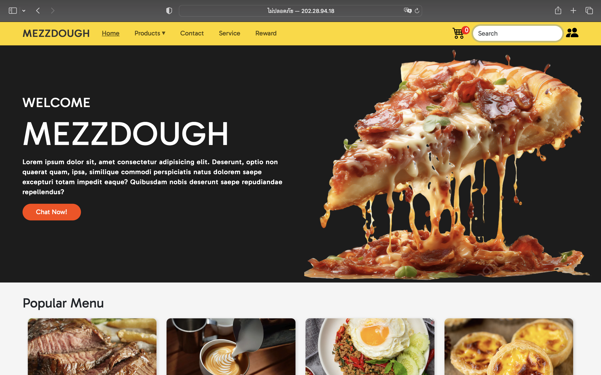

# FrontEnd-Website-Project
# MEZZDOUGH


## Overview
MEZZDOUGH เป็นโปรเจค Frontend สำหรับเว็บไซต์ร้านอาหาร โดยออกแบบ UI ให้มีความสวยงาม ทันสมัย และใช้งานง่าย มีโทนสีหลักเป็นสีดำและเหลืองเพื่อความโดดเด่น

## Features
- **Navigation Bar**: แถบเมนูด้านบนสำหรับเข้าถึงหมวดหมู่ต่างๆ เช่น Home, Products, Contact, Service และ Reward
- **Search Bar**: กล่องค้นหาพร้อมไอคอนตะกร้าสินค้าและโปรไฟล์ผู้ใช้
- **Hero Section**: พื้นที่เด่นที่แสดงภาพพิซซ่าขนาดใหญ่ พร้อมข้อความต้อนรับ และปุ่ม Call to Action "Chat Now!"
- **Popular Menu Section**: แสดงเมนูยอดนิยมพร้อมภาพอาหารแบบ Grid Layout

## Tech Stack
- **HTML5** - โครงสร้างพื้นฐานของหน้าเว็บ
- **CSS3** - ใช้สำหรับสไตล์ UI และเลย์เอาต์
- **JavaScript (ES6+)** - เพิ่มความโต้ตอบและการทำงานของ UI
- **Bootstrap 5** - ใช้ช่วยในการจัดเลย์เอาต์และสไตล์ให้เว็บไซต์

## Installation
1. Clone this repository:
   ```bash
   git clone https://github.com/mayisme02/mezzdough-frontend.git
   ```
2. Navigate to the project directory:
   ```bash
   cd mezzdough-frontend
   ```
3. Open `index.html` in a browser or use Live Server for better development experience.

## How to Contribute
1. Fork this repository
2. Create a new branch (`git checkout -b feature-name`)
3. Commit your changes (`git commit -m 'Add some feature'`)
4. Push to the branch (`git push origin feature-name`)
5. Create a Pull Request

## License
This project is licensed under the MIT License.


demo --> http://202.28.94.18/wdt66/group/cs/cs19/index.html
Project by Maysa and Donut
